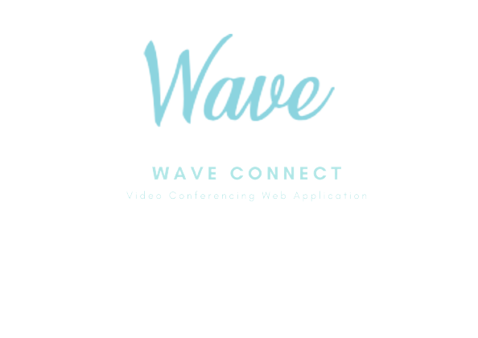
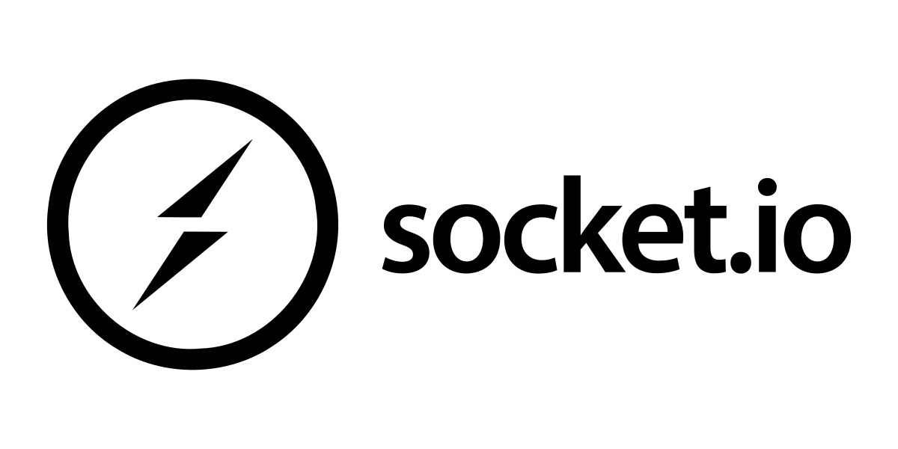
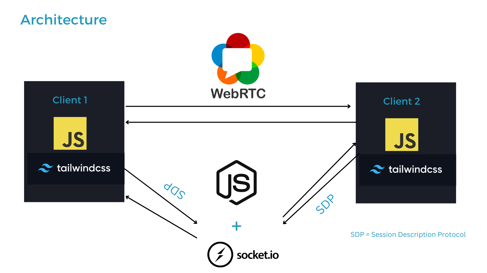

<h1 align="center">
  
</h1>

<p align="center">
  <a></a>
  
  <a></a>
  <a></a>
  <a></a>
</p>

<p align="center">
  <a href="#description">Description</a> •
  <a href="#architecture">Architecture</a> •
  <a href="#webrtc">WebRTC</a> •
  <a href="#installation-and-setup">Installation and Setup</a> •
  <a href="#license">License</a>
</p>

---

### **Description**

WaveConnect is a JavaScript-based video conferencing application using **WebRTC**, featuring **a mesh topology** to facilitate seamless multi-peer connections.

### **Architecture**



### **WebRTC**

- A wants to connect to B.
- A creates an offer, which includes SDP, ICE candidates, and security options.
- A sends the offer to B using a chosen method.
- B creates an answer after processing A's offer.
- B sends the answer back to A.
- Connection is established.

(Additional information about NAT, STUN, TURN, ICE, and SDP is provided.)

### **Installation and Setup**

**Prerequisites:** `node js`, `yarn/npm`, `git`

1. Clone the repository:

```bash
git clone https://github.com/VenuChoudhary001/Wave.git
```

Change the directory to wave-server

```
cd wave-server
$ yarn dev
```

#### Setup Peer server

- Using `npm`

```
$ npm install peer -g
```

- Using `yarn`

```
$ yarn add peer -g
```

#### Running peer server

Open a new terminal window and run server

```
$ peerjs --port 9000
```

Change the directory to wave-client

Install dependencies

```
$ yarn
```

Add the socket port here

```
let socket = io(`${SOCKET_SERVER_URL}`);
const myPeer = new Peer(undefined, {
  host: "/",
  port: "9000",
});
```

Start client

```
$ yarn start
```

## License

This project uses an [MIT](https://opensource.org/licenses/MIT) license.

<p align="right">(<a href="#top">back to top</a>)</p>
